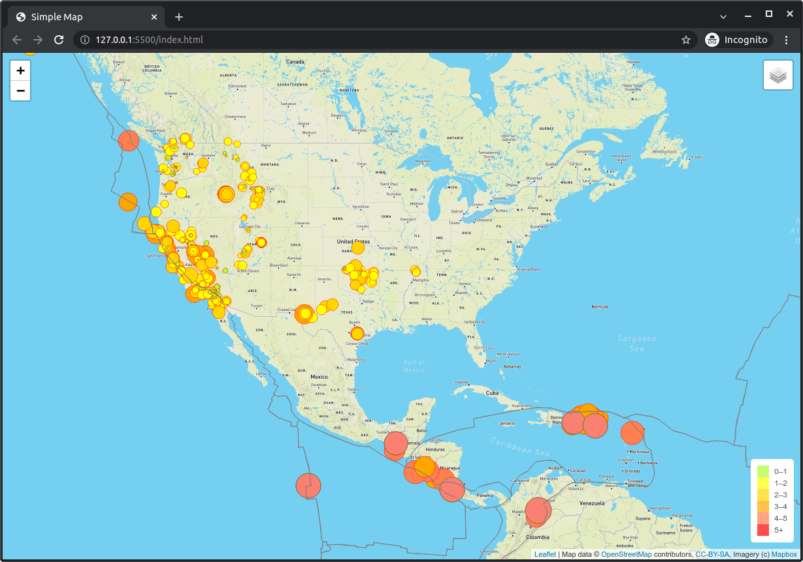

# Mapping_Earthquakes

With the use of D3, Leaflet, Mapbox and JavaScript we were requested to displau in a map the earthquakes registered by the USGS (https://earthquake.usgs.gov).
In this case the information source is online in the USGS site, so the code requires internet connection in order to be executed correctly.

------------------------------------------------------------------------

### About the characteristics in the code

It was necessary to add all the objects to represent the earthquakes and their data, such as geolocation and magnitud.
Also some layers were added in order to provide different views to the user.

The code allows us to define the initial view, center location, elevation (zoom level), map style, etc.
The D3 library simplifies the task of coding with maps, and guide us through the understanding of different topologies, such as networks, polygons and points.
As well as the GIS system (Geographical Information System) build the maps using different projection methods.

In the following example we can zoom one of the major earthquakes registered, and pop-up the information related, by the time we change the view:

-------------------

-------------------

------------------------------------------------------------------------

### Conclusions

We can now enrich the code to make a continuos refresh having updated data and displaying the information as real-time possible.
This example applies for several business cases and is just the tip of the iceberg of what we can do to get informed.
